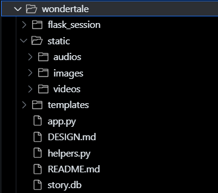

# Overview
`Wondertale Indonesia` is  Web-based application developed with python, HTML, and CSS. the main modules used to develope `Wondertale Indonesia`  is using web application framework `Flask, you can see for more detail [here](https://palletsprojects.com/p/flask/), then we using [CS50 Library](https://cs50.readthedocs.io/libraries/cs50/python/) for Python, and for the database we used is [SQLite](https://www.sqlite.org/index.html).

link to the wondertale video, and how to enjoy read the folktale : [Wondertale Indonesia]( https://s.id/Wondertale-Indonesia )


# Details
## Database Schema
The database is designed using a relational model because there will be many folklore titles from various regions and from many users.  In addition, each title has a different cover, different video links and different regions.

`users` table: to store the personal data of each user who sign up

```sql

CREATE TABLE 'users' (
	id INTEGER PRIMARY KEY AUTOINCREMENT NOT NULL,
	username TEXT NOT NULL,
	password TEXT NOT NULL,
	role TEXT CHECK( role IN ('admin', 'user') ) NOT NULL
);
	CREATE UNIQUE INDEX username ON users (username);
```
`stories` table: to store data such as folklore titles, folklore regions of origin, cover images, video links, and audio links.

```sql
CREATE TABLE 'stories' (
	id INTEGER PRIMARY KEY AUTOINCREMENT NOT NULL,
	title TEXT NOT NULL,
	origin TEXT NOT NULL,
	story TEXT NOT NULL,
	image TEXT NOT NULL,
	video TEXT NOT NULL,
	audio TEXT NOT NULL,
	status EXT NOT NULL DEFAULT 'pending'
);
```

## structure


all the resources that used in this web are located inside the `static`, meanwhile `templates` stores all the HTML files that render the results returned by `app.py`.
`helpers.py` is to implementation of apology, it ultimately renders a tamplate `apology.html`. it also happens to define several functions, we adapted by CS50's apology from `finance`

# Challenges
1. Due to we display a map on our homepage which a certain coordinate point, we are still difficult in creating our web more responsive.
1. When creating database, we also found a challenge how to create our database running smoothly. After we asked several people and watched some videos on youTube, we can run it well.
1. In approving the story from the readers, we also found some technical problem. It's how to create admin and how to give an admin to give some review on the reader's story. So until now, we are still developing on it.
1. Finding a sound in a good intonation of the story is not easy as we thought. Then we finally recorded them all by our voice.


# Future Improvements
1. this website can be published, and used by public
1. this website can responsively in many devices
