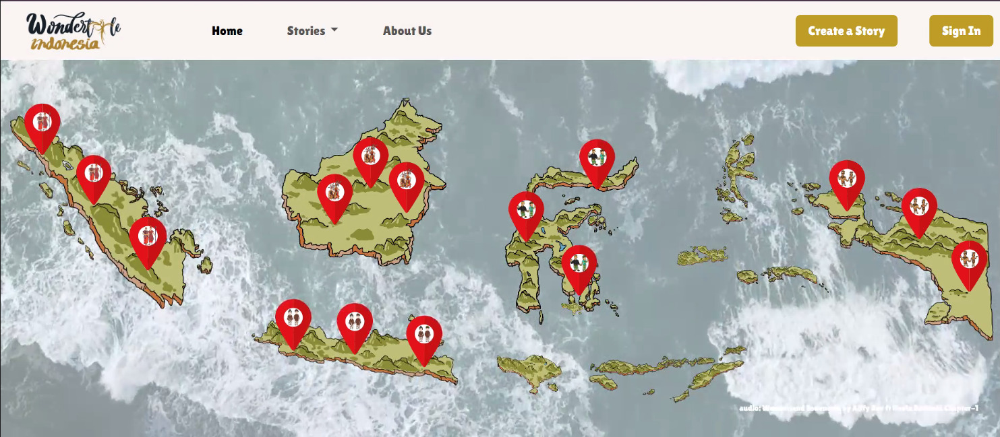
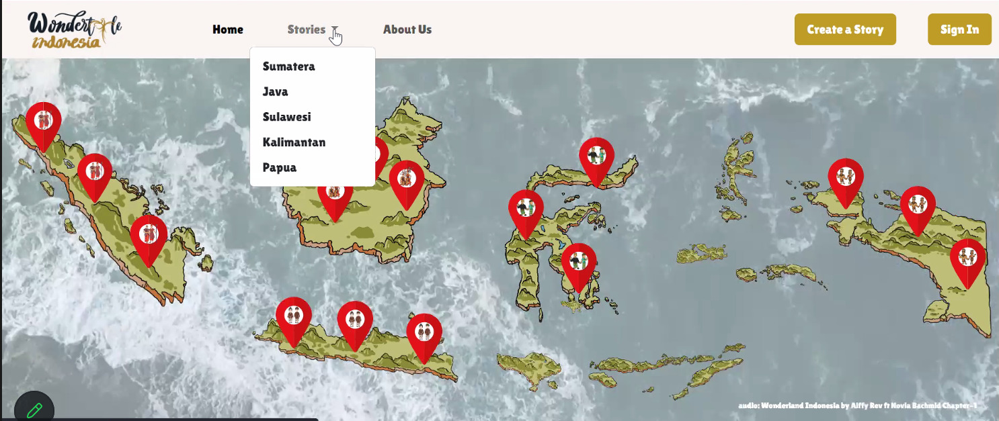
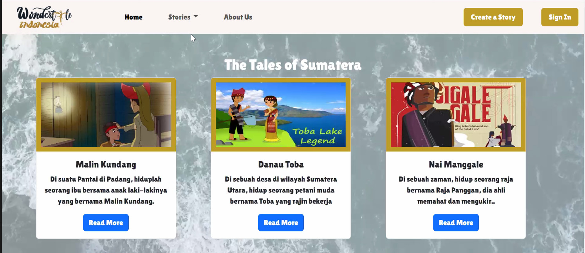
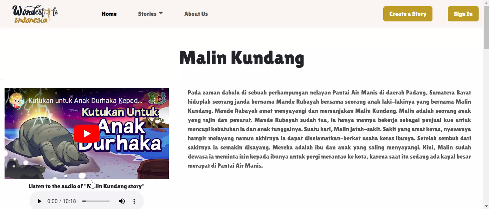
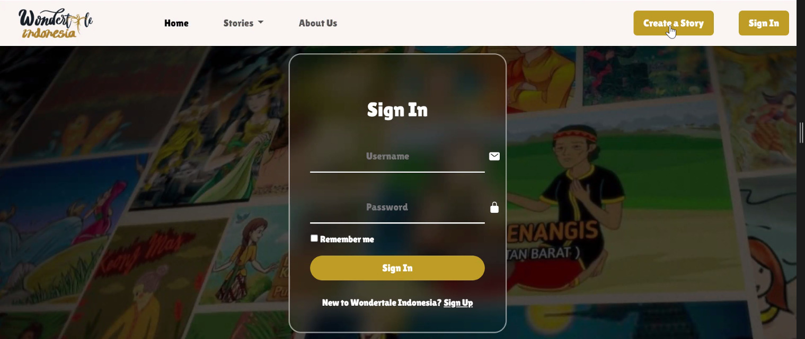
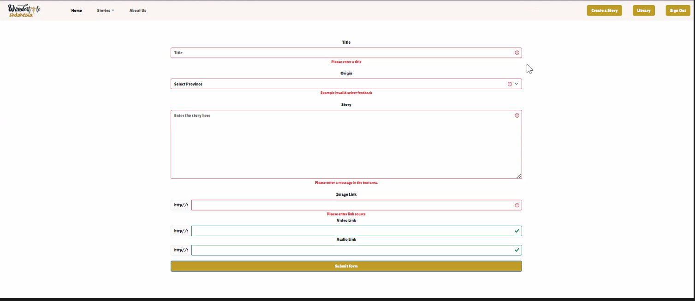

# 1. Wondertale Indonesia Description

Wondertale is a website that provides Indonesian folklore. As we know that Indonesia has more than 17.000 islands. At the first step,  this website only covers 5 islands, namely Sumatra, Java, Kalimantan, Sulawei and Papua. The stories are presented in the form of text, sound and video. As the content development, this website also offers the readers to upload other folk tales. With the features on this website, hopefully the readers will become more familiar with Indonesian folklore and the various of Indonesian cultures; be able to tell stories by learning from the audio and or video; and/or make this website as one of the research sources related to Indonesian folklore and cultures.

Link to the video: https://s.id/Wondertale-Indonesia

To get the web-app by github: https://github.com/riaangok/wondertale-indonesia

or

To get the web-app by Gdrive: https://s.id/FP-Gdrive-Wondertale-Indonesia


Aims of Wondertale Indonesia:
1. To introduce all folklore of Indonesia globally
2. To introduce bahasa Indonesia through the folklore
3. To make easier both the teachers and students in finding folklore of Indonesia
4. To provide a source of Indonesian folklore for researchers

Wonder Team of Wondertale Indonesia :
1. Dian Khoirun Nikmah
2. Ria Anggorowati Oktaviani

# 2. Softwares/Modules/Libraries

To use `Wondertale Indonesia` through github, you need to have the following softwares installed in your local computer:

 1. Python 3.11 https://www.python.org/downloads/
 2. PIP https://pip.pypa.io/en/stable/
 3. CS50 Library for Python https://cs50.readthedocs.io/libraries/cs50/python/.
 4. Flask-Session https://flask-session.readthedocs.io/en/latest/
 5. Git https://git-scm.com/doc

## 2.1 Install Python
Refer to this article to install and configure Python: https://realpython.com/installing-python/

## 2.2 Install PIP
Refer to this documentation to install PIP:
https://pip.pypa.io/en/stable/installation/

## 2.3 Install CS50 for Python
Use the following command in your terminal to install CS50 for Python:

    $  pip3 install cs50
The command will also install all other modules used in this project.

## 2.4 Install Flask-Session

Use the following command in your terminal to install Flask-Session:

    $  pip3 install Flask-Session
## 2.5 Install and Configure Git
Refer to this documentation to install and configure Git: https://git-scm.com/book/en/v2/Getting-Started-Installing-Git

# 3. Getting Started

 1. Log into https://cs50.dev/ , click on your terminal window, and execute cd by itself. You should find that your terminal window’s prompt resembles the below:

    ```
    $
    ```

    Upload zip - file in order to download a ZIP called .zip into your codespace.

    Then execute

    ```
    unzip wondertale.zip
    ```

    to create a folder called finance. You no longer need the ZIP file, so you can execute

    ```
    rm wondertale.zip
    ```

    and respond with “y” followed by Enter at the prompt to remove the ZIP file you downloaded.

    Now type

    ```
    cd wondertale
    ```

    followed by Enter to move yourself into (i.e., open) that directory. Your prompt should now resemble the below.

    ```
    wondertale/ $
    ```

    Execute ls by itself, and you should see a few files and folders:

    ```
    app.py  story.db  helpers.py     static/  templates/
    ```

    If you run into any trouble, follow these same steps again and see if you can determine where you went wrong!

# 4. Explore Wondertale Indonesia

1. Open the terminal, then type

    ```
    $ wondertale/ flask run
    ```
    Visit the URL outputted by flask to see the distribution code in action.

2. Open the web from the terminal.
    

3. If the you want to read the story, you just click the button of the maps for each island, or go to stories feature.


    In stories feature, you can choose one of the island that provided. After you click one of the island, you will enter to the stories.


4. Choose one of the story inside that page. After you open it, example, Malin Kundang, the page will provide you a text of the story, sound of the story and video of the story which embedded to youTube.


5. After exploring your stories, you can move to another feature. It's create a story. In this page, it's required you to have an account.
    If you don't have it, you just register in simple steps. Just create a username, password and confirm it.


6. The data that you must upload when creating a story is you must type the title, province, story and upload image link. Beside that, you also can upload sound and or video link. But for both of them is just optional.


7. If you have finished, you just leave the web by signing out.

# 5. Credits

 1. https://www.youtube.com/watch?v=aKtb7Y3qOck - audio backsound “Wonderland Indonesia” by Alffy Rev ft. Novia Bachmid (Chapter 1)
 2. https://youtu.be/rAKUgawbmoY - malinkundang
 3. https://youtu.be/Ixg99LvYHXI - danau toba
 4. https://youtu.be/vAzHrzOtbnM - nai manggale
 5. https://youtu.be/7-I-I_oJvjg - lutung kasarung
 6. https://youtu.be/N5VQYcmEBwk - roro jonggrang
 7. https://youtu.be/X6IrY6aHGXo - sangkuriang
 8. https://youtu.be/7QvAQly8u5Y - putri tandampalik
 9. https://youtu.be/0NKiVH1K7kI - batu bagga
 10. https://youtu.be/VeFOiGrXxPk - sigarlaki dan limbat
 11. https://youtu.be/VLdSlFfWt1A - batu menangis
 12. https://youtu.be/6nj6M3Plntg - pangeran biawak
 13. https://youtu.be/joH0bGAtwN8 - danau lipan
 14. https://youtu.be/84rmfTdtEsg - raja ampat
 15. https://youtu.be/dRiUeERsJUA - asal usul irian
 16. https://youtu.be/CPyXHwdd2pE - asal usul burung cendrawasih
